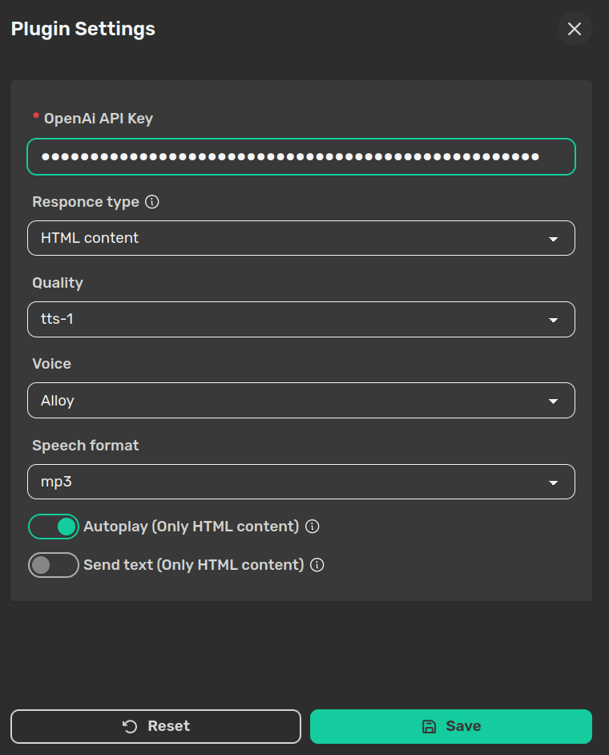

# OpenAI TTS Plugin

[](https://)

Experience the charming voice of the Cheshire Cat with the power of [OpenAI TTS API](https://platform.openai.com/docs/guides/text-to-speech). Select from 6 distinct voices, each offering a range of expressions and accents across a variety of [supported languages](https://platform.openai.com/docs/guides/text-to-speech/supported-languages).

## Installation

Choose one of the following methods to install the plugin:

1. **Install via CheshireCat Admin Panel:**
   - Navigate to the plugins tab in the CheshireCat admin panel.
   - Utilize the search bar to locate the plugin, then click "install".

2. **Manual Installation:**
   - Clone the repository into the CheshireCat plugins folder using the command:

    ```bash
    git clone https://github.com/Pingdred/openai-tts.git
    ```

   - Activate the plugin in the admin panel under the plugins tab.

Once installed, access the plugin settings from the admin panel, set your OpenAI API key, and immerse yourself in the enchanting voice of the Cheshire Cat!

## Response Type

The `Response Type` setting defines how you receive the voice file. Choose from two options:

- **HTML Content:**
  - This default option embeds the audio within an HTML element, compatible with Admin. The `content` of the websocket response will contain an HTML audio element with the audio file.
- **TTS Key:**
  - Selecting this option adds the file URL in the websocket response under the `tts` key. Useful for clients like [Meowgram](https://github.com/Pingdred/Meowgram) that require only the file URL.



## Tips

Don't like CheshireCat's current voice? Just request a change and the magic happens!
